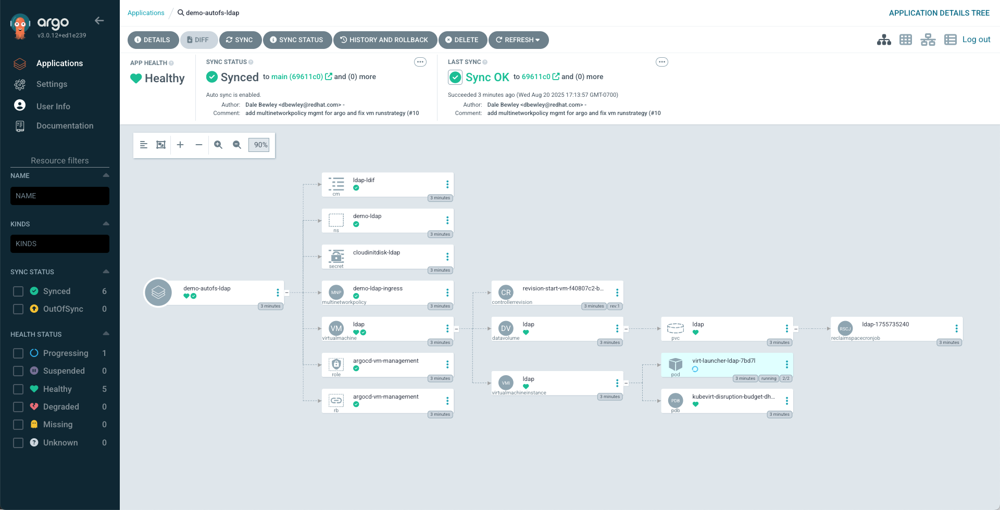
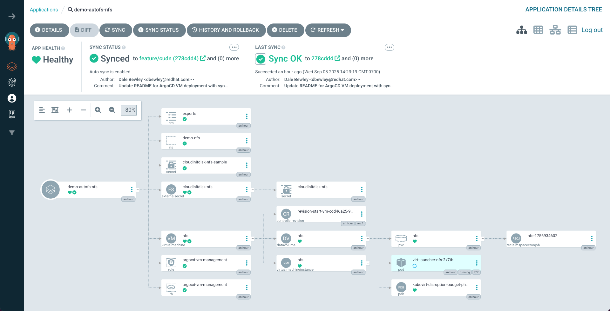

# Deploy VMs using ArgoCD

This is a manual workaround for my lack of secret management in my lab.

Use kustomize to create the namespace and the userData secret as it exists in my working dirctory.

THen create the ArgoCD application pointing at the git repo. The userData secret is annotated to prevent ArgoCD from modifying it with the copy stored in git which allows the Virtual Machine to use the correct userData containing RHEL subscription information.

```bash
oc delete -k argo-apps/client
oc delete namespace demo-client
oc kustomize client/base | kfilt -n cloudinitdisk-client -k namespace | oc apply -f -
oc apply -k argo-apps/client

oc delete -k argo-apps/ldap
oc delete namespace demo-ldap
oc kustomize ldap/base | kfilt -n cloudinitdisk-ldap -k namespace | oc apply -f -
oc apply -k argo-apps/ldap

oc delete -k argo-apps/nfs
oc delete namespace demo-nfs
oc kustomize nfs/base | kfilt -n cloudinitdisk-nfs -k namespace | oc apply -f -
oc apply -k argo-apps/nfs
```

**Deployed Applications**



