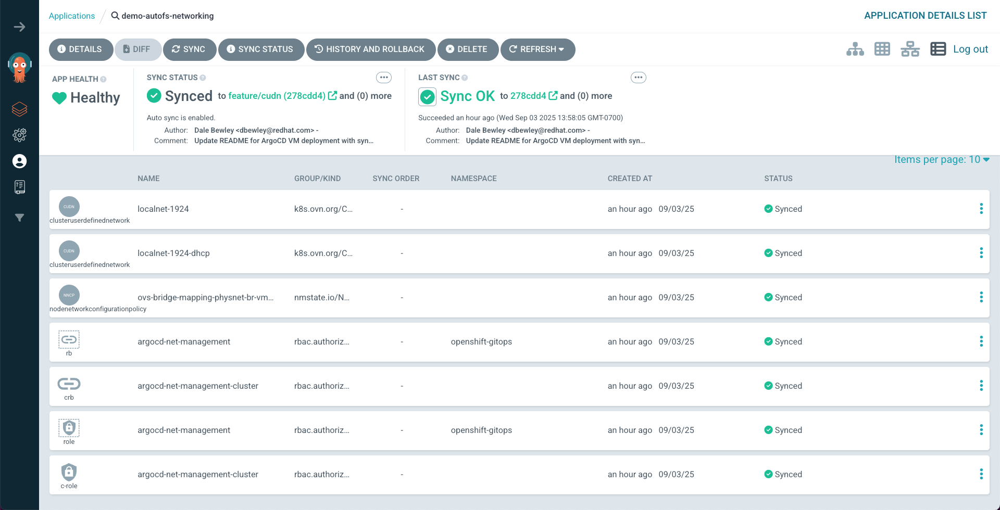
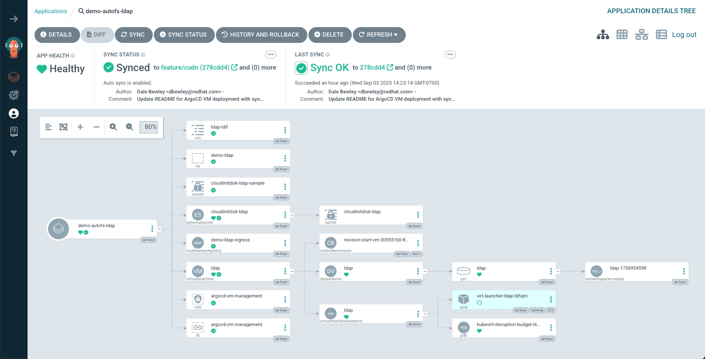
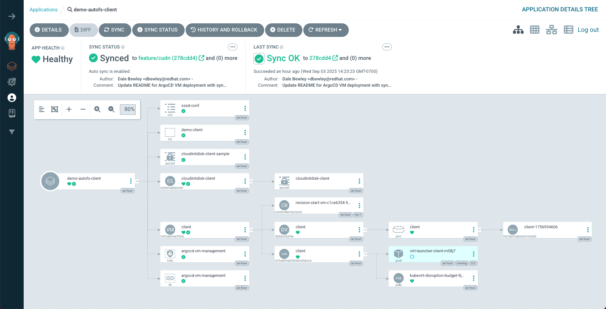

# Deploy VMs using ArgoCD

# Argo Apps

The following ArgoCD applications are defined:

* [demo-autofs App of Apps](demo-autofs/kustomization.yaml) - Deploys all of the following:
  * [demo-autofs-client](client/application.yaml) - Deploys client VM
  * [demo-autofs-ldap](ldap/application.yaml) - Deploys LDAP server VM
  * [demo-autofs-networking](networking/application.yaml) - Sets up required networking configuration
  * [demo-autofs-nfs](nfs/application.yaml) - Deploys NFS server VM

## Cloud-init User Data Hack

> ![NOTE]
> This hacky manual workaround for cloud-init is required due to the currentl lack of secrets management in my lab environment.

Use kustomize to create the namespace and the userData secret as it exists in my working dirctory.

Then create the ArgoCD application pointing at the git repo. The userData secret is annotated to prevent ArgoCD from modifying it with the copy stored in git which allows the Virtual Machine to use the correct userData containing RHEL subscription information.


## Deploying Alls As An App of Apps

```bash
# hacky workaround for cloud init secret management
oc kustomize client/base | kfilt -n cloudinitdisk-client -k namespace | oc apply -f -
oc kustomize ldap/base | kfilt -n cloudinitdisk-ldap -k namespace | oc apply -f -
oc kustomize nfs/base | kfilt -n cloudinitdisk-nfs -k namespace | oc apply -f -

oc apply -k argo-apps/demo-autofs
```

## Deploying Each App Individually
```bash
oc apply -k argo-apps/networking

oc delete -k argo-apps/client
oc delete namespace demo-client
oc kustomize client/base | kfilt -n cloudinitdisk-client -k namespace | oc apply -f -
oc apply -k argo-apps/client

oc delete -k argo-apps/ldap
oc delete namespace demo-ldap
oc kustomize ldap/base | kfilt -n cloudinitdisk-ldap -k namespace | oc apply -f -
oc apply -k argo-apps/ldap

oc delete -k argo-apps/nfs
oc delete namespace demo-nfs
oc kustomize nfs/base | kfilt -n cloudinitdisk-nfs -k namespace | oc apply -f -
oc apply -k argo-apps/nfs
```

## Deployed Applications








# Secret Management WIP

## Install ESO

Install a version of ESO which supports the 1password-sdk provider. The 1password-connect provider is deprecated provider and the operators in the OpenShift catalog as of 2025-08 are based on ESO 0.10.0.

* Install latest upstream ESO using Helm

```bash
$ helm repo add external-secrets https://charts.external-secrets.io

$ oc new-project external-secrets

$ helm install external-secrets \
   external-secrets/external-secrets \
   -n external-secrets
```

## Setup 1Password

* create a 1Password vault

```bash
$ op vault create eso --icon gears
```

* Create a token to login to 1Password. 90 days was max allowed :(

```bash
$ TOKEN=$(
    op service-account create external-secrets-operator \
      --expires-in 90d \
      --vault eso:read_items,write_items \
    )
```

To test access: `export OP_SERVICE_ACCOUNT_TOKEN=$TOKEN`

* Place token in a secret allowing ESO to access 1Password

 ```bash
$ oc create secret generic onepassword-connect-token \
  --from-literal=token="$TOKEN" \
  -n external-secrets
```

## Setup ESO

```yaml
---
apiVersion: external-secrets.io/v1
kind: ClusterSecretStore
metadata:
  name: 1password-sdk
spec:
  provider:
    onepasswordSDK:
      vault: eso
      auth:
        serviceAccountSecretRef:
          name: onepassword-connect-token
          key: token
          namespace: external-secrets
```

## Write Data 1Password

* Edit `{client,ldap,nfs}/base/scripts/userData` and insert configuration that should not be stored in git. Eg. Red Hat subscription activation keys.

* Store the VM userData for each VM in 1Password <https://developer.1password.com/docs/cli/item-create/>

```bash
vault=eso
for vm in client ldap nfs; do
  op item create \
    --vault "$vault" \
    --category login \
    --title "demo autofs $vm" \
    --url "https://github.com/dlbewley/demo-autofs/tree/main/${vm}/base/scripts" \
    --tags demo=autofs \
    "[file]=${vm}/base/scripts/userData"
done
```


### Read Data from 1Password

* This will be done through the External Secret Operator.

```yaml
apiVersion: external-secrets.io/v1
kind: ExternalSecret
metadata:
  name: cloudinitdisk-client
spec:
  secretStoreRef:
    kind: ClusterSecretStore
    name: 1password-sdk
  target:
    name: cloudinitdisk-client # this will be the name of the secret
    creationPolicy: Owner
  data:

  - secretKey: "userData" # this will be a field in the secret
    remoteRef:
      key: "demo autofs client/userData"
```

This will automatically create a Secret named `cloudinitdisk-client`.

# Todo

- Refactor to use ESO info above instead of the current hack.