# OpenLDAP Server in OpenShift Virtualization Linux VM

* Add any required changes to [userData script](base/scripts/userData), but do not commit the changes to git.

* Upload this to 1Password or another ClusterSecretStore.

```bash
vault=eso
vm=ldap
op item create \
    --vault "$vault" \
    --category login \
    --title "demo autofs $vm" \
    --url "https://github.com/dlbewley/demo-autofs/tree/main/${vm}/base/scripts" \
    --tags demo=autofs \
    "[file]=${vm}/base/scripts/userData"
```
* Deploy the VM

```bash
oc apply -k ldap/base
# or
oc apply -k argo-apps/ldap
```

## Firewalling with MultiNetworkPolicy

This namespace has a [MultiNetworkPolicy](multinetworkpolicy.yaml) attached to it which permits only selective access to services on the LDAP server.

MultiNetworkPolicy must be enabled on the OpenShift cluster first and may then be used for secondary network attachments. Localnet VLAN 1924 in this case. Because we are using localnet topology we can not use pod selectors and must discriminate based on IP address. [Other secondary network topologies can](https://docs.redhat.com/en/documentation/openshift_container_platform/4.19/html/multiple_networks/secondary-networks#compatibility-with-multi-network-policy_configuring-additional-network-ovnk) use selectors as long as they also include a subnet field.

```yaml
---
# https://docs.redhat.com/en/documentation/openshift_container_platform/4.19/html/virtualization/networking#virt-connecting-vm-to-secondary-udn
# selectors are not supported for secondary localnet networks. ipBlock must be used.
apiVersion: k8s.cni.cncf.io/v1beta1
kind: MultiNetworkPolicy
metadata:
  annotations:
    k8s.v1.cni.cncf.io/policy-for: default/vlan-1924
  name: demo-ldap-ingress
  namespace: demo-ldap
spec:
  podSelector: {}

  policyTypes:
    - Ingress

  ingress:
    # allow from all to dhcpclient
    - from:
      ports:
        - port: 67
          protocol: UDP
        - port: 68
          protocol: UDP

    # allow from wifi and lab network to ldap service
    - from:
        - ipBlock:
            cidr: 192.168.3.0/24
            except: []
        - ipBlock:
            cidr: 192.168.4.0/24
            except: []
      ports:
        - port: 389
          protocol: TCP
        - port: 636
          protocol: TCP

    # allow from wifi network to ssh service
    - from:
        - ipBlock:
            cidr: 192.168.3.0/24
            except: []
      ports:
        - port: 22
          protocol: TCP
```


### Policy Summary

The `demo-ldap-ingress` MultiNetworkPolicy allows:

1. **DHCP Client Access**: All networks can access DHCP client ports (67/UDP, 68/UDP) which enables DHCP to work on the VM
2. **LDAP Service Access**: Only the WiFi (192.168.3.0/24) and Lab (192.168.4.0/24) networks can access LDAP ports (389/TCP, 636/TCP)
3. **SSH Access**: Only WiFi network (192.168.3.0/24) can access SSH port (22/TCP)

The policy is applied to the `default/vlan-1924` localnet network and affects all pods in the `demo-ldap` namespace using this secondary network.

### Policy Diagram

This diagram illustrates the 'demo-ldap-ingress' MultiNetworkPolicy applied to the 'ldap' virtual machine in the 'demo-ldap' namespace.

```mermaid
graph LR
    subgraph "demo-ldap Namespace"
        subgraph VM["LDAP Virtual Machine"]

            DHCP[DHCP Client<br/>Ports: 67/UDP, 68/UDP]
            LDAP[LDAP Service<br/>Ports: 389/TCP, 636/TCP]
            SSH[SSH Service<br/>Port: 22/TCP]
        end
    end

    subgraph "External Networks"
        WIFI[💻 WiFi Network<br/>192.168.3.0/24]
        LAB[🔬Lab Network<br/>192.168.4.0/24]
        ALL[👬 All Networks]
    end

    %% DHCP access from all networks
    ALL -->|UDP 67,68| DHCP

    %% LDAP access from WiFi and Lab networks
    WIFI -->|TCP 389,636| LDAP
    LAB -->|TCP 389,636| LDAP

    %% SSH access only from WiFi network
    WIFI -->|TCP 22| SSH

    %% Policy details
    subgraph "MultiNetworkPolicy"
        POLICY[👮 Policy applied to:<br/>default/vlan-1924]
        POLICY -.-> VM
    end

    %% Styling
    classDef vm fill:#e1f5fe,stroke:#01579b,stroke-width:2px
    classDef service fill:#f3e5f5,stroke:#4a148c,stroke-width:2px
    classDef network fill:#e8f5e8,stroke:#1b5e20,stroke-width:2px
    classDef policy fill:#fff3e0,stroke:#e65100,stroke-width:2px

    class VM vm
    class DHCP,LDAP,SSH service
    class WIFI,LAB,ALL network
    class POLICY policy
```

