# ClusterUserDefinedNetwork Configuration for Autofs Demonstration


This will deploy to a CUDN of `localnet` topology on VLAN 1924. This segment will be accessed via the physical network `physnet-br-vmdata` associated with an OVS bridge on the worker nodes. These items are referenced via reusable [components](../components/).

* Create an appropriate [overlay](overlays/homelab/kustomization.yaml) for the network.

* Add the appropriate [NodeNetworkConfigurationPolicy](../components/physnet-mapping/nncp.yaml) to the overlay.

* Add the appropriate [ClusterUserDefinedNetwork](../components/localnet-1924-dhcp/clusteruserdefinednetwork.yaml) to the overlay.

* Deploy the networking overlay.

```bash
oc apply -k networking/overlays/homelab
# or
oc apply -k argo-apps/networking
```
> [!IMPORTANT]
> Namespaces associated with a Primary UDN or a Cluster UDN will fail to delete so long as they are in scope of the UDN. That means you need to unlable the namespace or alter the UDN to successfully delete the namespace. eg `oc label namespace demo-client localnet-`. https://issues.redhat.com/browse/OCPBUGS-61463

## Physical Network Configuration

Nodes may have a single Network Interface Card or multiple cards bound together for redundancy and greater throughput.

### Node Example: 2 NICs, 1 bond

If multiple VLANs are trunked to `bond0`, a VLAN interface would be created at install time for the machine network. An OVS bridge `br-ex` will be attached there to take over the node IP address. At this point, `br-vmdata` could be attached at `bond0` instead.

> [!TIP]
> This same example also applies to a node with a single NIC.

```mermaid
graph LR;
    subgraph Cluster[" "]

      subgraph Localnets["Physnet Mappings"]
        physnet-vmdata[Localnet<br> 🧭 physnet-br-vmdata]
      end

      subgraph node1["🖥️ Node "]
        br-ex[ OVS Bridge<br> 🔗 br-ex]
        br-vmdata[ OVS Bridge<br> 🔗 br-vmdata]
        node1-bond0[bond0 🔌]
        node1-vlan-machine[bond0.123 🔌]
      end
    end

    physnet-vmdata -- maps to --> br-vmdata
    br-ex --> node1-vlan-machine --> node1-bond0
    br-vmdata --> node1-bond0

    Internet["☁️ "]:::Internet
    node1-bond0 ==(🏷️ 802.1q trunk)==> Internet

    classDef node-eth fill:#00dddd,color:#00f,stroke:#333,stroke-width:2px

    classDef vlan-default fill:#00aadd,color:#00f,stroke:#333,stroke-width:2px
    class br-ex,node1-vlan-machine,node1-bond0 vlan-default

    classDef vlan-1924 fill:#00dddd,color:#00f,stroke:#333,stroke-width:2px
    class node1-vlan1924,br-vmdata,physnet-vmdata vlan-1924

    classDef labels stroke-width:1px,color:#fff,fill:#005577
    classDef networks fill:#cdd,stroke-width:0px

    style Localnets fill:#fff,stroke:#000,stroke-width:1px
    style Cluster color:#000,fill:#fff,stroke:#333,stroke-width:0px
    style Internet fill:none,stroke-width:0px,font-size:+2em

    classDef nodes fill:#fff,stroke:#000,stroke-width:3px
    class node1,node2,node3 nodes

    classDef node-eth fill:#00dddd,color:#00f,stroke:#333,stroke-width:2px
    class node1-bond1 node-eth

    classDef nad-1924 fill:#00ffff,color:#00f,stroke:#333,stroke-width:1px
    class nad-1924-client,nad-1924-ldap,nad-1924-nfs nad-1924
```



### Node Example: 4 NICs, 2 bonds

The first two interfaces are bound into `bond0`. There is only a native VLAN on this bond.
The second two interfaces are bound into `bond1` which recieve multiple VLAN tags from the switch.

```mermaid
graph LR;
    subgraph Cluster[" "]

      subgraph Localnets["Physnet Mappings"]
        physnet-vmdata[Localnet<br> 🧭 physnet-br-vmdata]
      end

      subgraph node1["🖥️ Node "]
        br-ex[ OVS Bridge<br> 🔗 br-ex]
        br-vmdata[ OVS Bridge<br> 🔗 br-vmdata]
        node1-bond0[bond0 🔌]
        node1-bond1[bond1 🔌]
      end
    end

    physnet-vmdata -- maps to --> br-vmdata
    br-ex --> node1-bond0
    br-vmdata --> node1-bond1

    Internet["☁️ "]:::Internet
    node1-bond0 ==default gw==> Internet
    node1-bond1 ==(🏷️ 802.1q trunk)==> Internet

    classDef node-eth fill:#00dddd,color:#00f,stroke:#333,stroke-width:2px

    classDef vlan-default fill:#00aadd,color:#00f,stroke:#333,stroke-width:2px
    class br-ex,node1-bond0 vlan-default

    classDef vlan-1924 fill:#00dddd,color:#00f,stroke:#333,stroke-width:2px
    class br-vmdata,physnet-vmdata vlan-1924

    classDef labels stroke-width:1px,color:#fff,fill:#005577
    classDef networks fill:#cdd,stroke-width:0px

    style Localnets fill:#fff,stroke:#000,stroke-width:1px
    style Cluster color:#000,fill:#fff,stroke:#333,stroke-width:0px
    style Internet fill:none,stroke-width:0px,font-size:+2em

    classDef nodes fill:#fff,stroke:#000,stroke-width:3px
    class node1,node2,node3 nodes

    classDef node-eth fill:#00dddd,color:#00f,stroke:#333,stroke-width:2px
    class node1-bond1 node-eth

    classDef nad-1924 fill:#00ffff,color:#00f,stroke:#333,stroke-width:1px
    class nad-1924-client,nad-1924-ldap,nad-1924-nfs nad-1924
```



## Logical Network Definition

The `ClusterUserDefinedNetwork` [localnet-1924](../components/localnet-1924/clusteruserdefinednetwork.yaml) references `physicalNetworkName` "physnet-br-vmdata" which is associated with the bridge "br-vmdata" by [this NNCP](../components/physnet-mapping/nncp.yaml)  which defines an [OVS bridge mapping](https://gist.github.com/dlbewley/9a846ac0ebbdce647af0a8fb2b47f9d0).

```mermaid
graph LR;
    subgraph Cluster[" "]
      udn-localnet-1924["CUDN<br>️ 📄 localnet-1924"]:::udn-localnet-1924
      udn-controller[/"⚙️ UDN Controller"/]

      subgraph Localnets["Physnet Mappings"]
        physnet[Localnet<br> 🧭 physnet-br-vmdata]:::nad-1924;
      end

      subgraph Project["Project Scoped"]
        subgraph ns-nfs["🗄️ **demo-nfs** Namespace"]
          label-nfs("🏷️ localnet=1924"):::labels;
          nad-1924-nfs[NAD<br> 🛜 localnet-1924];
        end

        subgraph ns-ldap["🔎 **demo-ldap** Namespace"]
          label-ldap("🏷️ localnet=1924"):::labels;
          nad-1924-ldap[NAD<br> 🛜 localnet-1924]:::nad-1924;
        end

        subgraph ns-client["💻 **demo-client** Namespace"]
          label-client("🏷️ localnet=1924"):::labels;
          nad-1924-client[NAD<br> 🛜 localnet-1924]:::nad-1924;
        end
      end
      subgraph node1["🖥️ Node "]
        br-vmdata[ OVS Bridge<br> 🔗 br-vmdata]:::vlan-1924;
      end
    end

    udn-localnet-1924 -. selects .-> ns-client
    udn-localnet-1924 -. selects .-> ns-ldap
    udn-localnet-1924 -. selects .-> ns-nfs

    linkStyle 0,1,2 stroke:#007799,stroke-width:2px;

    udn-controller --creates--> nad-1924-nfs
    udn-controller --creates--> nad-1924-ldap
    udn-controller --creates--> nad-1924-client

    linkStyle 3,4,5 stroke:#00dddd,stroke-width:2px;

    udn-controller == implements ==> udn-localnet-1924
    udn-localnet-1924 -. references .-> physnet
    physnet -- maps to --> br-vmdata

    linkStyle 6,7,8 stroke-width:2px;

    Internet["☁️ "]:::Internet
    br-vmdata ==> Internet

    classDef node-eth fill:#00dddd,color:#00f,stroke:#333,stroke-width:2px;

    classDef vlan-1924 fill:#00dddd,color:#00f,stroke:#333,stroke-width:2px;
    classDef udn-localnet-1924 fill:#00ffff,color:#00f,stroke:#333,stroke-width:2px;

    classDef labels stroke-width:1px,color:#fff,fill:#005577;
    classDef networks fill:#cdd,stroke-width:0px;

    style udn-controller fill:#fff,stroke:#000,stroke-width:1px;
    style node1 fill:#fff,stroke:#000,stroke-width:3px;
    style Localnets fill:#fff,stroke:#000,stroke-width:1px;
    style Cluster color:#000,fill:#fff,stroke:#333,stroke-width:0px;
    style Project color:#000,fill:#dff,stroke:#333,stroke-width:0px
    style Internet fill:none,stroke-width:0px,font-size:+2em;

    classDef nodes stroke-width:3px;
    class node1,node2,node3 nodes;
    classDef namespace color:#000,fill:#fff,stroke:#000,stroke-width:2px;
    class ns-nfs,ns-client,ns-ldap namespace;

    classDef nad-1924 fill:#00ffff,color:#00f,stroke:#333,stroke-width:1px;
    class nad-1924-client,nad-1924-ldap,nad-1924-nfs nad-1924;
```



## VM Connectivity

The UDN Controller will ensure that any namespace identified by the CUDN selector has a `NetworkAttachmentDefinition` created within it. This NAD will be used to create a port on the vswitch for the virtual machine NICs to attach to.

```mermaid
graph LR;
    subgraph Cluster[" "]

      subgraph Project[" "]
        subgraph ns-nfs["🗄️ **demo-nfs** Namespace"]
          label-nfs("🏷️ localnet=1924")
          nad-1924-nfs[NAD<br> 🛜 localnet-1924]
          subgraph vm-nfs["🗄️ NFS Server"]
              nfs-eth0[eth0 🔌]
          end
        end

        subgraph ns-ldap["🔎 **demo-ldap** Namespace"]
          label-ldap("🏷️ localnet=1924")
          nad-1924-ldap[NAD<br> 🛜 localnet-1924]
          subgraph vm-ldap["🔎 LDAP Server"]
              ldap-eth0[eth0 🔌]
          end
        end

        subgraph ns-client["💻 **demo-client** Namespace"]
          label-client("🏷️ localnet=1924")
          nad-1924-client[NAD<br> 🛜 localnet-1924]
          subgraph vm-client["💻 Client"]
              client-eth0[eth0 🔌]
          end
        end

      end

      subgraph node1["🖥️ Node "]
        br-vmdata[ OVS Bridge<br> 🔗 br-vmdata]:::vlan-1924;
      end
    end

    nfs-eth0    ---> nad-1924-nfs
    ldap-eth0   ---> nad-1924-ldap
    client-eth0 ---> nad-1924-client


    nad-1924-client --> br-vmdata
    nad-1924-ldap --> br-vmdata
    nad-1924-nfs --> br-vmdata


    linkStyle 0,1,2,3,4,5 stroke:#00dddd,stroke-width:2px;

    Internet["☁️ "]:::Internet
    br-vmdata ==> Internet


    classDef node-eth fill:#00dddd,color:#00f,stroke:#333,stroke-width:2px;
    class node1-eth0 node-eth;

    classDef vm-eth fill:#00ffff,color:#00f,stroke:#444,stroke-width:1px;
    class client-eth0,ldap-eth0,nfs-eth0 vm-eth;

    classDef vlan-1924 fill:#00dddd,color:#00f,stroke:#333,stroke-width:2px;

    classDef labels stroke-width:1px,color:#fff,fill:#005577;
    class label-client,label-ldap,label-nfs labels;

    style Cluster color:#000,fill:#fff,stroke:#333,stroke-width:0px;
    style Project color:#000,fill:#dff,stroke:#333,stroke-width:0px;
    style Internet fill:none,stroke-width:0px,font-size:+2em;

    classDef vm color:#000,fill:#eee,stroke:#000,stroke-width:2px
    class vm-client,vm-ldap,vm-nfs vm

    classDef nodes fill:#fff,stroke:#000,stroke-width:3px;
    class node1 nodes;

    classDef namespace color:#000,fill:#fff,stroke:#000,stroke-width:2px;
    class ns-nfs,ns-client,ns-ldap namespace;

    classDef nad-1924 fill:#00ffff,color:#00f,stroke:#333,stroke-width:1px;
    class nad-1924-client,nad-1924-ldap,nad-1924-nfs nad-1924;
```


