# ClusterUserDefinedNetwork Configuration for Autofs Demonstration


This will deploy to a CUDN of `localnet` topology on VLAN 1924 which will be accessed via the physical network `physnet-br-vmdata` on the worker nodes. These items are referenced via reusable [components](../components/).

* Create an appropriate [overlay](overlays/homelab/kustomization.yaml) for the network.

* Add the appropriate [NodeNetworkConfigurationPolicy](../components/physnet-mapping/nncp.yaml) to the overlay.

* Add the appropriate [ClusterUserDefinedNetwork](../components/localnet-1924-dhcp/clusteruserdefinednetwork.yaml) to the overlay.

* Deploy the networking overlay.

```bash
oc apply -k networking/overlays/homelab
# or
oc apply -k argo-apps/networking
```
> [!IMPORTANT]
> Namespaces associated with a Primary UDN or a Cluster UDN will fail to delete so long as they are in scope of the UDN. That means you need to unlable the namespace or alter the UDN to successfully delete the namespace. eg `oc label namespace demo-client localnet-`. https://issues.redhat.com/browse/OCPBUGS-61463

```mermaid
graph LR;
    subgraph Cluster["Cluster Scoped"]
      udn-localnet-1924["CUDN<br> 📃 localnet-1924"]:::udn-localnet-1924
      udn-controller[/"⚙️ UDN Controller"/]

      subgraph Localnets["Physnet Mappings"]
        physnet[Localnet<br> 🛜 physnet-br-vmdata]:::nad-1924;
      end

      subgraph Project["Project Scoped"]
        subgraph ns-nfs["🗄️ NFS Namespace"]
          label-nfs("🏷️ localnet=1924"):::labels;
          nad-1924-nfs[NAD<br> 🛜 localnet-1924]:::nad-1924;
        end

        subgraph ns-ldap["🔎 LDAP Namespace"]
          label-ldap("🏷️ localnet=1924"):::labels;
          nad-1924-ldap[NAD<br> 🛜 localnet-1924]:::nad-1924;
        end

        subgraph ns-client["💻 Client Namespace"]
          label-client("🏷️ localnet=1924"):::labels;
          nad-1924-client[NAD<br> 🛜 localnet-1924]:::nad-1924;
        end
      end
    end

    subgraph Physical["Physical Network"]
      subgraph node1["🖥️ Node "]
        br-vmdata[ OVS Bridge<br> 🛜 br-vmdata]:::vlan-1924;
      end
    end

    udn-localnet-1924 -. selects ..-> ns-client
    udn-localnet-1924 -. selects ..-> ns-ldap
    udn-localnet-1924 -. selects ..-> ns-nfs


    linkStyle 0,1,2 stroke:#007799

    udn-controller --creates--> nad-1924-nfs
    udn-controller --creates--> nad-1924-ldap
    udn-controller --creates--> nad-1924-client

    linkStyle 3,4,5 stroke:#00dddd,stroke-width:2px;

    udn-controller == implements ==> udn-localnet-1924


    udn-localnet-1924 -. references .-> physnet
    physnet -- maps to --> br-vmdata

    linkStyle 6,7,8 stroke:#ddd,stroke-width:2px;

    Internet["☁️ "]:::Internet
    br-vmdata ==> Internet

    classDef node-eth fill:#00dddd,color:#00f,stroke:#333,stroke-width:2px;

    classDef vlan-1924 fill:#00dddd,color:#00f,stroke:#333,stroke-width:2px;
    classDef nad-1924 fill:#00ffff,color:#00f,stroke:#333,stroke-width:2px,stroke-dasharray: 5 5;
    classDef udn-localnet-1924 fill:#00ffff,color:#00f,stroke:#333,stroke-width:2px;

    classDef labels stroke-width:1px,color:#fff,fill:#005577;
    classDef networks fill:#cdd,stroke-width:0px;

    style udn-controller fill:#fff,stroke:#000,stroke-width:1px;
    style node1 fill:#fff,stroke:#000,stroke-width:1px;
    style Localnets fill:#fff,stroke:#000,stroke-width:1px;
    style Cluster color:#000,fill:#fff,stroke:#333,stroke-width:3px;
    style Physical color:#000,fill:#fff,stroke:#333,stroke-width:3px;
    style Project color:#000,fill:#dff,stroke:#333,stroke-width:0px
    style Internet fill:none,stroke-width:0px,font-size:+2em;

    classDef nodes stroke-width:3px;
    class node1,node2,node3 nodes;
    classDef namespace color:#fff,fill:#005577,stroke:#000,stroke-width:2px;
    class ns-nfs,ns-client,ns-ldap namespace;
```

```mermaid
graph LR;
    Internet["☁️ "]:::Internet
    vlan-1924[🛜 VLAN 1924<br>192.168.4.0/24<br>]:::vlan-1924;
    vlan-1924 ==> Internet
    nad-1924 <---> vlan-1924

    subgraph Physical["Physical"]
      subgraph node1["🖥️ Node 1"]
        node1-eth0[eth0 🔌]:::node-eth;
      end
      subgraph node2["🖥️ Node 2"]
        node2-eth0[eth0 🔌]:::node-eth;
      end
      subgraph node3["🖥️ Node 3"]
        node3-eth0[eth0 🔌]:::node-eth;
      end

      node1-eth0 ==> vlan-1924
      node2-eth0 ==> vlan-1924;
      node3-eth0 ==> vlan-1924;
    end

    subgraph Virtual["Virtual"]
      subgraph Localnets["Localnet NADs"]
          nad-1924[🛜 localnet-1924]:::nad-1924;
      end

      subgraph NFS-Server["🗄️ NFS Server"]
          server-1-eth0[eth0 🔌]:::vm-eth;
      end

      subgraph LDAP-Server["🔎 LDAP Server"]
          server-2-eth0[eth0 🔌]:::vm-eth;
      end

      subgraph Client["💻 Client"]
          server-3-eth0[eth0 🔌]:::vm-eth;
      end
    end

    server-1-eth0 -.-> nad-1924
    server-2-eth0 -.-> nad-1924
    server-3-eth0 -.-> nad-1924

    classDef node-eth fill:#00dddd,color:#00f,stroke:#333,stroke-width:2px;
    classDef vm-eth fill:#00ffff,color:#00f,stroke:#444,stroke-width:2px,stroke-dasharray: 1 1;

    classDef vlan-1924 fill:#00dddd,color:#00f,stroke:#333,stroke-width:2px;
    classDef nad-1924 fill:#00ffff,color:#00f,stroke:#333,stroke-width:2px,stroke-dasharray: 5 5;

    classDef networks fill:#cdd,stroke-width:0px

    style Localnets stroke-width:0px;
    style Physical color:#ccc,fill:#222,stroke:#333,stroke-width:3px
    style Virtual color:#ddd,fill:#333,stroke:#333,stroke-width:2px,stroke-dasharray: 5 5;
    style Internet fill:none,stroke-width:0px,font-size:+2em;

    classDef servers stroke-width:3px,stroke-dasharray: 5 5;
    class NFS-Server,LDAP-Server,Client servers

    classDef nodes stroke-width:3px
    class node1,node2,node3 nodes

```



